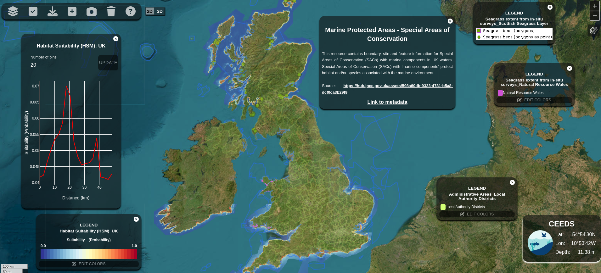

# Mapa 2D

A versao 2D foi baseada na biblioteca [React Leaflet](https://react-leaflet.js.org/). Foram criados alguns pacotes adicionais para interagir com os diferentes tipos de dados, que serao descritos nas outras features.

Para o mapa 2D, estao sendo utilizados como mapa bases os seguintes layers:
- OpenStreetMap: https://tile.openstreetmap.org/{z}/{x}/{y}.png
- NASA Blue Marble: https://gibs-{s}.earthdata.nasa.gov/wmts/epsg3857/best/BlueMarble_ShadedRelief_Bathymetry/default//EPSG3857_500m/{z}/{y}/{x}.jpeg

 

*Visao geral do mapa em 2D utilizando React Leaflet*

## Interacao com o Mapa

A interacao com o mapa se da pela definicao de uma props 'ref' no MapContainer do React Leaflet.

E' passado para essa props 'ref' um setState setMap, criado no componente do Map.

Toda vez que uma layer e' adicionada ao mapa, e' informado um valor de 'attribution' que e' unico para a layer. Com isso, toda vez que queremos interagir com essa layer, buscamos a layer com o valor de attributtion espcifico e realizamos as operacoes necessarias.

Devido a restricoes no webpack para uso com o React Vite, nao foi possivel adicionar varias bibliotecas auxiliares do Leaflet ao projeto. Dessa forma, estas biblioteca foram adicionadas manualmente, copiando-se o arquivo .js oa repositorio. Sao elas:

- leflet-ruler.js: realizacao de medidas de distancia no mapa
- vectorgrid: adicionar arquivos MBTils
- CanvasLayers: adicionar arquivos .asc ao mapa

