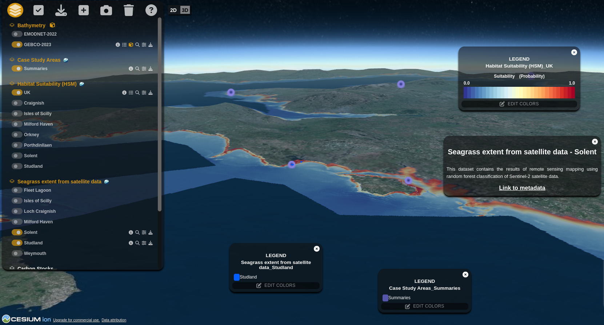

# Mapa 2D

A versao 3D foi baseada na biblioteca [Resium](https://resium.reearth.io/) (Cesium for React). Foram criados alguns pacotes adicionais para interagir com os diferentes tipos de dados, que serao descritos nas outras features.

<br>


*Visao geral do mapa em 3D utilizando Resium*

## Interacao com o Mapa

A interacao com o mapa se da pela definicao de uma props 'ref' no Viewer do Resium.

E' passado para essa props 'ref' um useRef do React, criado no componente do Mapa 3d

Toda vez que uma layer e' adicionada ao mapa, e' informado um valor de 'attribution' que e' unico para a layer. Com isso, toda vez que queremos interagir com essa layer, buscamos a layer com o valor de attributtion especifico e realizamos as operacoes necessarias.

E' importante salientar que o Cesium lida com layers de maneira diferente do Leaflet. A diferenca e' que cada tipo de layer e' salva no Cesium como um componente diferente. Um outro ponto importante e' que algumas layers no Cesium nao podem ser alteracas. Por isso, optou-se em muitos casos por remover e adicionar a layer.

## Observacoes importantes

O React tem uma caracteristica de renderizar todos os componentes da pagina duas vezes. Essa e' uma caracteristica importante do React, pois auxiliar na realizacao de testes em desenvolvimento. Entretanto, quando estamos trabalhando com o Resium, isso se torna um problema. Na pratica, o React renderiza dois mapas 3D, sendo que somente o segundo mapa fica interativo. Dessa forma, de modo a permitir que voce consiga testar e usar o mapa quando em desenvolvimento, voce deve:

- remover a props 'full' do Viewer;
- Adicionar as seguintes informacoes aos 'styles.ts' do mapa 3d:

```
export const ResiumContainer = styled.div`
  /* div:first-child {
    div:first-child {
      height: 500px;
    }
  } */
`
```

Essas informacoes devem ser removidas quando o aplicativo for enviado para producao.

## Observacoes

Cabe destacar que tambem foi implementado um mapa exemplo utilizando MapBox3D, mas que nao esta atualmente em producao.
