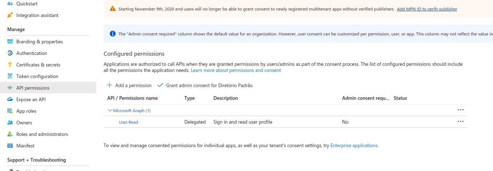

# Authenticacao

Foram configuradas duas formas de autenticacao no aplicativo: utilizando ORCID e utilizando Microsoft 365. Para ambos os casos, o aplicativo funciona da seguinte forma:

## Criar aplicativo nas plataformas

Primeiramente, voce deve se cadastras nas plataformas para poder utilizar o servicoes de OAUTH disponibilizados por elas.

- ORCID

Realize o login no ORCID e acesse o link: https://orcid.org/developer-tools. Posteriormente, voce devera seguir os procedimentos descritos nesse link: https://info.orcid.org/documentation/integration-guide/registering-a-public-api-client/.

Apos cadastrar seu aplicativo, voce deve atualizar as seguintes informacoes no arquivo .env:

```
VITE_ORCID_CLIENT_ID=
VITE_ORCID_CLIENT_SECRET=
```

Estas informacoes tambem deverao ser atualizadas no aplicativo backend, que sera comentado mais para frente.


- Microsoft 365

Para o Microsoft 365, primeiramente voce deve criar uma conta na Azure Cloud, por meio do link https://portal.azure.com. Caso voce crie a conta utilizando o seu email profissional, para poder criar aplicativos voce devera entrar em contato com o Help Desk para solicitar autorizacao para essa atividades.

Com a conta criada, voce deve registrar seu aplicativo: https://portal.azure.com/#view/Microsoft_AAD_RegisteredApps/ApplicationsListBlade

Clique em "New registration" e preencha as informacoes sobre a sua aplicacao. Depois voce deve clicar em "API Permissions" e cliar uma nova permissao, conforme imagem a seguir:



Depois voce deve clicar em "Certificates and Secrets" e gerar um novo segredo. Apos as informacoes geradas, voce deve atualizar o arquivo ENV:

```
VITE_365_CLIENT_ID=
VITE_365_TENANCY_ID=
VITE_365_REDIRECT_URI=
```

Estas informacoes tambem deverao ser atualizadas no aplicativo backend, que sera comentado mais para frente.

## Etapas de autenticacao

A primeira etapa que o aplicativo realiza ao ser carregado e' verificar os cookies para checar se ha alguma informacao no Cookie nome 'token'. Este cookie e' um texto jwt com informacoes sobre o usuario. Este token e' passado para o aplicativo backend, que converte o token para um json e checa se o usuario existe e se tem autorizacao para acessar o aplicativo. Essa checagem e' realizada atraves de uma lista de emails e ORCID ids disponiveis no aplicativo backend. Caso o usuario existe, essa informacao e' passada ao frontend, que autoriza que o usuario prosiga com a uso do sistema. Essa checagem descrita acima e' realizada pelo arquivo 'src/lib/auth.ts'.

Caso o usuario nao exista ou nao haja um cookie com o nome 'token', o usuario devera fazer o login atraves da pagina de login:


O sistema de login conecta com os aplicativos criados no ORCID e na Microsft 365 para obter um 'code' para uso unico. Este code representa um single use code para acessar a api desses aplicativos e obter as informacoes dos usuarios.

Este single use code e enviado pelos authenticadores para a rota '/auth' que envia esse 'code' para o backend. No backend, ha novamente comunicaca com os sistemas da ORCID e da Microsoft 365 para poder obter os dados dos usuarios.

Por fim, o backend retorna para o frontend um token em jwt para ser salvo como cookie. E' importante salientar que o cookie tem um prazo de expiracao.
