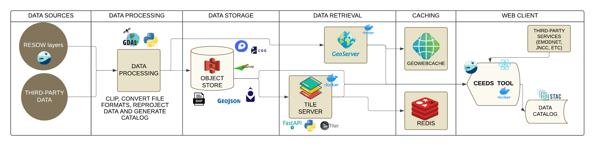

# Home

The Coastal Ecosystem Enhancement Decision Support (CEEDS) tool is a critical component of the Sustainable Management of Marine Resources (SMMR) funded Restoration of Seagrass for Ocean Wealth (ReSOW) UK project. The CEEDS Tool brings together all data and reports from the project in a manner that is accessible and can be explored spatially, aligning with the needs and priorities of our community.

## General Project Infrastructure

This project is based on a web-client that accesses data from different locations and uses various microservices related to APIs and tile servers. Below, we will describe the project's infrastructure in more detail.

As shown in the figure above, both the frontend and all microservices are running in Docker containers. These Docker containers are stored in a container registry. Currently, we are using gitlab container registry. The containers are updated each time a push is made to the master repository of the container.

## Repositories

These are the project repositories:

- [Frontend](https://gitlab.com/nocacuk/ocean-informatics/ReSOW/frontend): A frontend application created in React, with the ability to interact with different data formats on both the backend and frontend. This project depends on certain backend services to perform tile server activities, as well as authentication and data calculations.

- [Tileserver](https://gitlab.com/nocacuk/ocean-informatics/ReSOW/tileserver): Repository for configuring and creating tile servers.

- [Geoserver](https://gitlab.com/nocacuk/ocean-informatics/ReSOW/geoserver): Repository for configuring and creating geoserver.

- [Data Pipelines](https://github.com/NOC-OI/data_pipelines): This repository contains all the code for data format conversion, data uploading to the Object Store, and STAC Catalog creation.

- [SALT Stack](https://gitlab.com/nocacuk/ocean-informatics/ReSOW/deploy): Repository contaning the Salt configuration for the VM.

## Server Instance Organization

The organization of server instances is carried out through the [SALT Stack](https://gitlab.com/nocacuk/ocean-informatics/ReSOW/deploy) repository. This repository is based on the configuration of server stacks in the [Salt project](https://saltproject.io/). More information about the use and configuration of Salt can be found in the [Salt repository in this project](https://gitlab.com/nocacuk/ocean-informatics/ReSOW/deploy).

## Deploying the Project

To deploy the project, follow the procedures [described here](deploy.md).

## CI/CD Pipeline

This repository includes an automatic GitLab CI/CD pipeline for continuous integration and continuous deployment. More information about this pipeline can be found in the [CI/CD Pipeline documentation](cicd.md).

## Data Organization: Object Store and STAC Catalog

All project data files are stored in an object store. In this case, the files are accessed via HTTP requests, without the need for an intermediate database or an API.

As the object store appears as a group of files, it is necessary to create a catalog of these files, called an [STAC Catalog](https://stacspec.org/en). The STAC catalog for this project can be accessed [here](https://radiantearth.github.io/stac-browser/#/external/ceeds-tool-store-o.s3-ext.jc.rl.ac.uk/ceeds/stac/catalog.json). For more information on how to generate the STAC Catalog, refer to the [Data Pipelines repository](https://github.com/NOC-OI/data_pipelines).

This project suggests an organization of files in the Object Store, as [described here](object_store.md).

If you want to understand a little bit more about how we deal with STAC Catalogs, please [click here](stac.md).

## Data Format Conversion

In this project, data from different formats is converted into formats optimized for the cloud. Data conversion is performed through a series of Python codes that convert data from the following formats: GeoTIFF, GeoJSON, Shapefile, FlatGeoBuf, COG, Zarr, NetCDF, among others.

The codes for converting data are described in the [Data Pipelines repository](https://github.com/NOC-OI/data_pipelines).

More information about all the data types that we have been working with are described below:

- [GeoTIFF and Cloud Optimized GeoTIFF (COG)](geotiff_cog.md)

- [FlatGeoBuf](fgb.md)

- [Geoserver](geoserver.md)

- [WMS Layers](wms.md)

- [Cesium Ion](cesium_ion.md)

## Frontend Application

The frontend application was developed in React and is converted into a Docker container. This app is currently running on Jasmin and Oracle Cloud and can be accessed via the link [https://ceeds.resow.uk](https://ceeds.resow.uk).

You can find a detailed explanation about all the frontend features [here](frontend.md).

More information about the frontend application can be found in the repository: [https://gitlab.com/nocacuk/ocean-informatics/ReSOW/frontend](https://gitlab.com/nocacuk/ocean-informatics/ReSOW/frontend)

## Tile Servers

Some data formats require the use of tile servers to optimize data rendering on the frontend. For this project, the following servers are used:

1) Titiler: FastAPI application for dynamic tiling. It is used for COG files. You can see more information [here](geotiff_cog.md).
2) Geoserver: An open source server for sharing geospatial data. You can see more information [here](geoserver.md).

The tile servers are converted into Docker containers. More information about the servers can be found in the repositories:
- [Tileserver](https://gitlab.com/nocacuk/ocean-informatics/ReSOW/tileserver).
- [Geoserver](https://gitlab.com/nocacuk/ocean-informatics/ReSOW/geoserver).
