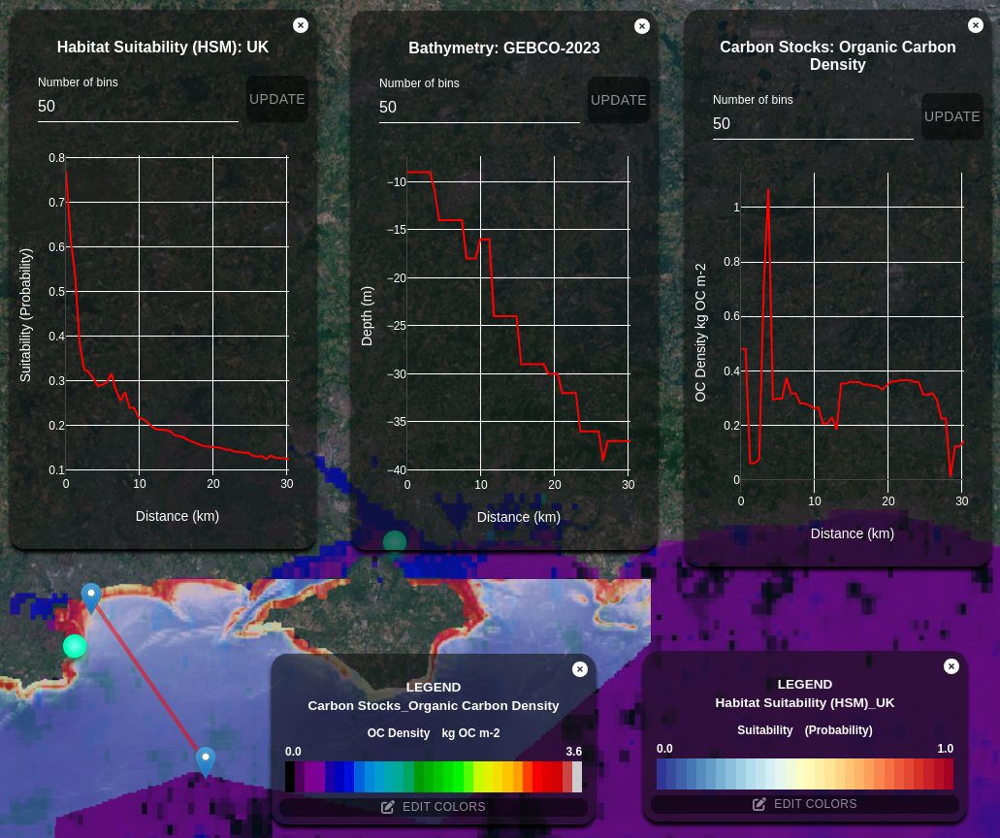

# GeoTIFF and Cloud Optimized GeoTIFF (COG)

## Overview

This repository documents our approach to using GeoTIFF files for raster data and converting them to Cloud Optimized GeoTIFF (COG) format when handling large files (over 10 MB). Working directly with large GeoTIFF files can be inefficient, as they require full dataset downloads to render in web GIS applications. By converting to COG format, we enable more efficient storage and display of geospatial data, specifically for web applications. This documentation outlines our COG processing approach and highlights the use of a tile server to accelerate frontend map rendering.

## Benefits of COG Format

Cloud Optimized GeoTIFF (COG) files are specially designed for efficient geospatial data storage. They allow quick access and rendering of large datasets without needing to load the entire file, making them ideal for web-based GIS applications.

## Tile Server Setup

### Tile Server: Powered by [titiler.xyz](https://www.titiler.xyz)

To access COG images, we use a tile server based on [titiler.xyz](https://www.titiler.xyz). Our production tile server is live at the following link:

- [CEEDS Tile Server](https://ceeds-tileserver.resow.uk/)

The source code and configuration for this tile server are available in our GitLab repository: [Tile Server Repository](https://gitlab.com/nocacuk/ocean-informatics/ReSOW/tileserver). This repository contains all source files, setup information, and documentation needed to understand the implementation.

Our project’s 2D and 3D maps leverage this tile server for efficient COG data rendering, resulting in a smooth and optimized user experience.

## Frontend COG Data Processing

In addition to the tile server, we use frontend processing to work with GeoTIFF and COG data via [Geoblaze](https://geoblaze.io/) and [georaster](https://github.com/GeoTIFF/georaster). These libraries enable direct interaction with COG data in the frontend, allowing various data operations directly within the web application.

*Example of a 2D map with COG rendering. The chart was created with the Geoblaze library for data extraction and Plotly for visualization.*